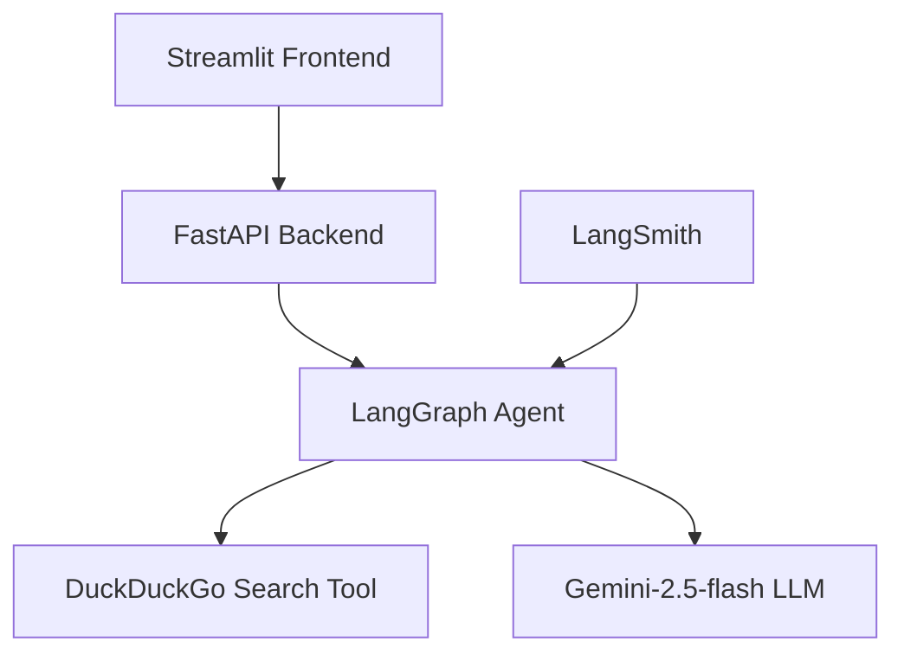

# 🎯 Cursor Vibe Coding Practice

> Cursor를 활용한 AI Agent 개발 연습 프로젝트

[](https://opensource.org/licenses/MIT)
[](https://www.python.org/downloads/release/python-3110/)
[](https://github.com/psf/black)

**Streamlit + FastAPI + LangGraph**를 활용한 AI 상품 검색 챗봇 프로젝트입니다.

## 📋 프로젝트 개요

이 프로젝트는 Cursor AI IDE를 활용하여 개발하는 현대적인 AI Agent 애플리케이션입니다. 사용자가 자연어로 상품을 검색하면, LangGraph Agent가 DuckDuckGo를 통해 실시간 검색을 수행하고 결과를 Streamlit 인터페이스로 제공합니다.

### 🏗️ 아키텍처



## 🚀 주요 기능

- 🔍 **자연어 상품 검색**: 대화형 인터페이스로 상품 검색
- 🤖 **AI Agent**: LangGraph 기반 React Agent
- 📊 **실시간 검색**: DuckDuckGo API를 통한 실시간 웹 검색
- 🎨 **현대적 UI**: Streamlit 기반 반응형 웹 인터페이스
- ⚡ **고성능 API**: FastAPI 기반 비동기 백엔드
- 📈 **모니터링**: LangSmith 연동 Agent 성능 모니터링

## 🛠️ 기술 스택

### Frontend
- **Streamlit** - 웹 인터페이스 및 사용자 상호작용
- **Python 3.11** - 메인 프로그래밍 언어

### Backend
- **FastAPI** - RESTful API 서버
- **uvicorn** - ASGI 서버

### AI/ML
- **LangGraph** - AI Agent 프레임워크
- **LangChain** - LLM 통합 및 도구 연결
- **Gemini-2.5-flash-preview** - Google의 최신 LLM
- **DuckDuckGo Search** - 웹 검색 도구

### Monitoring & DevOps
- **LangSmith** - Agent 성능 모니터링
- **GitHub Actions** - CI/CD 자동화
- **Pytest** - 테스트 프레임워크

## 📦 설치 및 실행

### 1. 저장소 클론

```bash
git clone https://github.com/jeongsehun/cursor-vibe-coding-practice.git
cd cursor-vibe-coding-practice
```

### 2. 가상환경 설정

```bash
# conda 환경 생성 및 활성화
conda create -n cursor-price-agent python=3.11
conda activate cursor-price-agent

# 또는 venv 사용
python -m venv venv
source venv/bin/activate  # Windows: venv\Scripts\activate
```

### 3. 의존성 설치

```bash
pip install -r requirements.txt
```

### 4. 환경변수 설정

`.env` 파일을 생성하고 다음 내용을 설정하세요:

```env
# Google AI API Key (Gemini 모델 사용)
GOOGLE_API_KEY=your_google_api_key_here

# LangSmith 모니터링 (선택사항)
LANGSMITH_API_KEY=your_langsmith_api_key_here
LANGSMITH_TRACING=true
LANGSMITH_PROJECT=cursor-vibe-coding-practice
```

### 5. 애플리케이션 실행

#### 방법 1: Streamlit 단독 실행
```bash
streamlit run app.py
```

#### 방법 2: FastAPI + Streamlit 분리 실행
```bash
# Terminal 1: FastAPI 서버 실행
uvicorn main:app --reload --port 8000

# Terminal 2: Streamlit 앱 실행
streamlit run streamlit_app.py
```

### 6. 브라우저에서 확인

- **Streamlit 앱**: http://localhost:8501
- **FastAPI 문서**: http://localhost:8000/docs (분리 실행 시)

## 📱 사용법

1. **웹 애플리케이션 접속**: 브라우저에서 Streamlit 앱을 엽니다
2. **상품 검색**: 채팅 인터페이스에 원하는 상품을 자연어로 입력
   - 예: "아이폰 15 프로 가격 알려줘"
   - 예: "게이밍 노트북 추천해줘"
3. **결과 확인**: AI Agent가 실시간으로 검색하여 결과를 제공합니다

## 🔧 개발 환경 설정

### 코드 스타일
이 프로젝트는 일관된 코드 스타일을 위해 다음 도구들을 사용합니다:

```bash
# 코드 포맷팅
black .

# 린팅
flake8 .

# 타입 체크
mypy .
```

### 테스트 실행

```bash
# 전체 테스트 실행
pytest

# 커버리지 포함 테스트
pytest --cov=.

# 특정 테스트 파일 실행
pytest tests/test_agent.py
```

## 📂 프로젝트 구조

```
cursor-vibe-coding-practice/
├── 📁 .cursor/                 # Cursor IDE 설정
│   └── 📁 rules/              # 개발 룰 및 가이드라인
├── 📁 .github/                # GitHub 설정
│   ├── 📁 workflows/          # GitHub Actions
│   ├── 📁 ISSUE_TEMPLATE/     # 이슈 템플릿
│   └── 📄 pull_request_template.md
├── 📁 docs/                   # 프로젝트 문서
├── 📁 src/                    # 소스 코드 (예정)
│   ├── 📁 frontend/           # Streamlit 앱
│   ├── 📁 backend/            # FastAPI 서버
│   └── 📁 agent/              # LangGraph Agent
├── 📁 tests/                  # 테스트 코드 (예정)
├── 📄 .gitignore             # Git 무시 파일
├── 📄 requirements.txt       # Python 의존성 (예정)
├── 📄 .env.example           # 환경변수 예시 (예정)
└── 📄 README.md              # 프로젝트 문서
```

## 🤝 기여하기

이 프로젝트에 기여해주셔서 감사합니다! 

### 기여 방법

1. **Fork** 이 저장소
2. **Feature branch** 생성 (`git checkout -b feature/amazing-feature`)
3. **커밋** 변경사항 (`git commit -m 'feat: Add amazing feature'`)
4. **Push** to branch (`git push origin feature/amazing-feature`)
5. **Pull Request** 생성

### 이슈 리포트

버그를 발견하거나 기능 요청이 있으시면:

- 🐛 **버그 리포트**: [Bug Report 템플릿](.github/ISSUE_TEMPLATE/bug_report.md) 사용
- ✨ **기능 요청**: [Feature Request 템플릿](.github/ISSUE_TEMPLATE/feature_request.md) 사용
- ❓ **질문**: [Question 템플릿](.github/ISSUE_TEMPLATE/question.md) 사용

### 코드 리뷰 프로세스

모든 PR은 다음 과정을 거칩니다:

1. ✅ **자동 테스트** 통과
2. 🔍 **코드 리뷰** 완료
3. 📋 **체크리스트** 확인
4. 🚀 **병합** 승인

## 📊 개발 현황

- [x] 프로젝트 초기 설정
- [x] GitHub Actions CI/CD 구성
- [x] 이슈/PR 템플릿 설정
- [x] 라벨 체계 구축
- [ ] 기본 프로젝트 구조 구성
- [ ] Streamlit 프론트엔드 개발
- [ ] FastAPI 백엔드 개발
- [ ] LangGraph Agent 구현
- [ ] DuckDuckGo 검색 통합
- [ ] 테스트 코드 작성
- [ ] 문서화 완성

## 📈 성능 모니터링

LangSmith를 통해 다음 지표들을 모니터링합니다:

- 🔍 **검색 성능**: 응답 시간, 정확도
- 🤖 **Agent 성능**: 도구 사용 패턴, 성공률
- 📊 **사용자 경험**: 세션 길이, 만족도

## 📄 라이선스

이 프로젝트는 MIT 라이선스 하에 배포됩니다. 자세한 내용은 [LICENSE](LICENSE) 파일을 확인해주세요.

## 🙏 감사의 말

- **Cursor**: 혁신적인 AI 기반 IDE 제공
- **LangChain/LangGraph**: 강력한 AI Agent 프레임워크
- **Streamlit**: 빠른 웹 앱 개발 도구
- **FastAPI**: 현대적인 API 프레임워크

## 📞 연락처

- **GitHub**: [@jeongsehun](https://github.com/jeongsehun)
- **프로젝트 링크**: [cursor-vibe-coding-practice](https://github.com/jeongsehun/cursor-vibe-coding-practice)

---

⭐ 이 프로젝트가 도움이 되셨다면 Star를 눌러주세요! 